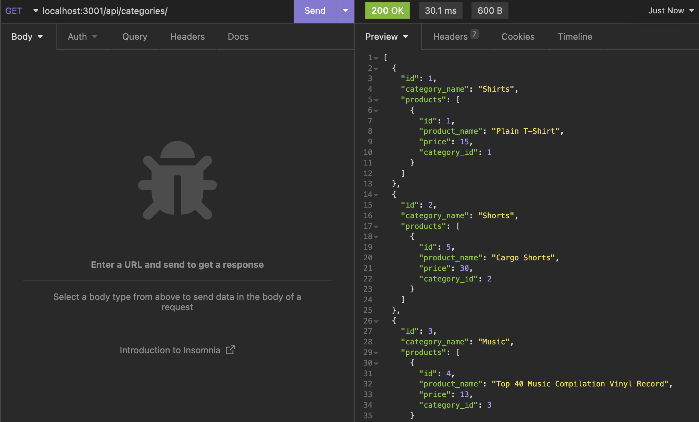
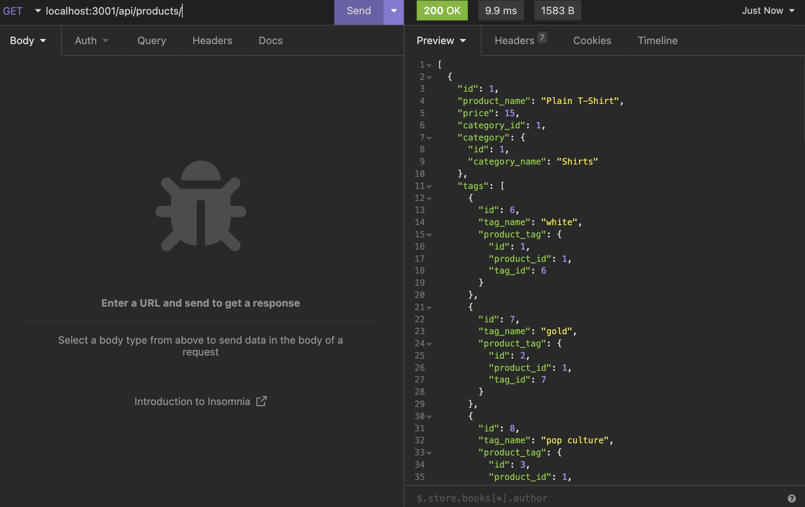
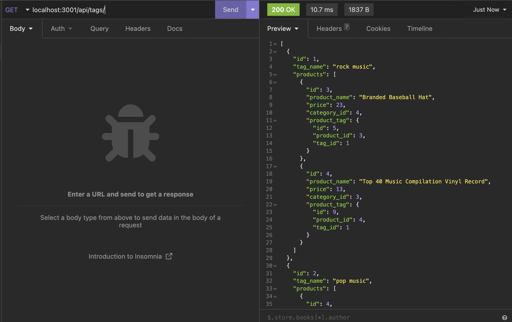

# ecommerce-backend
This is a back end ecommerce application that allows the user to get data, post new content, update current content and delete content in insomnia.
### Intallation:
to install the dependencies open the terminal and run:
npm i 
mysql -u root -p, source db/schema.sql, exit sql
npm run seed
npm start
### Usage:
manipulate thr routes in insomnia using the CRUD operations to receive/manipulate the data
### Contributors:
Keli-Rene Sparks

Tracy Guajardo
### screenshot:
examples of different GET routes

### Links
[github](https://github.com/mmontoya1112/ecommerce-backend)

[walk through pt1](https://drive.google.com/file/d/1Q_d4TCiTI74zOHXuEALyaoZmHJyaID_3/view)

[walk through pt2](https://drive.google.com/file/d/1C0Ih8T-EMr9NIwQUNYQGZQASylPjR3vV/view) 